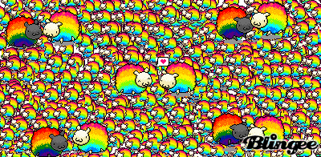

<!-- This won't be displayed but it will initialize your R session. Add any R libraries you need here. -->
```{r init,include=FALSE,echo=FALSE}
library(magrittr)
readLines('https://www.zotero.org/api/users/4684249/items/top?limit=25&format=bibtex&key=slAzDDCc7LkCcpCEYM7XDkM3&v=1') %>% writeLines('references.bib')
```


# Bienvenido! {-}


## Smart-Optimize my LinkedIn and Get Found by Recruiters {#abstract1}
<!-- Had to change your cross-references here since they shouldn't be duplicated with the main article -->

## Kelpie - Crowd Sourced Smart Hydroponics {#abstract2}

(ref:abs1) Hi I'm an abstract for your first big idea! I'm also a [text reference](https://bookdown.org/yihui/bookdown/markdown-extensions-by-bookdown.html#text-references), which is a line of text you can reuse in several places. Use me to write a one paragraph abstract and place it in `index.Rmd` as well as under the title of `01.Rmd`. Once defined, you can reuse me simply by writing `(ref:abs1)` where you want this text to go.

(ref:abs1)

### Abstract of my second cool idea {-}

(ref:abs2) I'm also an abstract! And a text reference! An abstract is all three acts of your story in a tight little package. You may or may not want to give the ending away, but if you think there's a chance an audience will read this and nothing else, you'd better convey your argument here in miniature. People are busy after all, and there's just so much good tv on the Internet these days.

(ref:abs2)

## About the author {-}

```{r hello-world,echo=FALSE,fig.cap='Fluffy rainbows',fig.align='center',out.width='100%'}

```

*Updated: `r Sys.Date()`*
